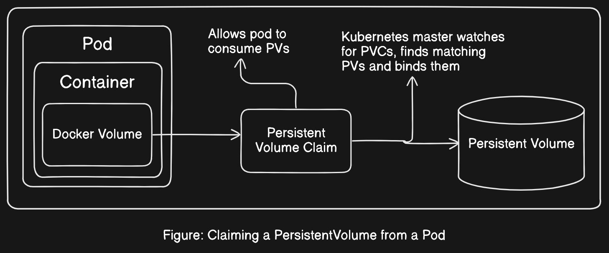
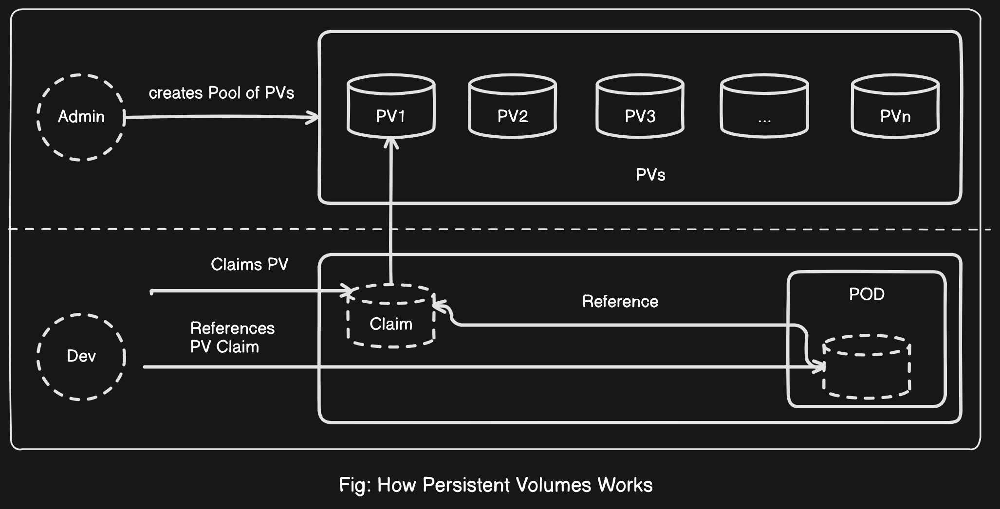
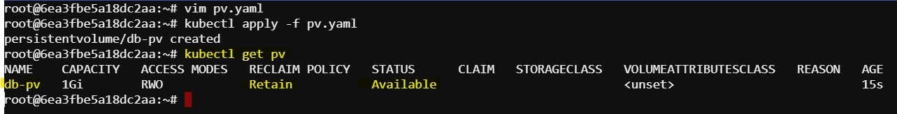
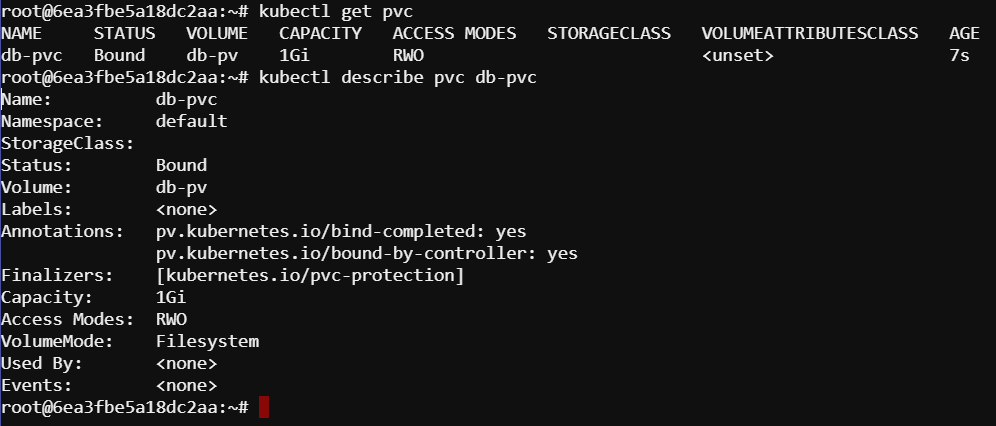
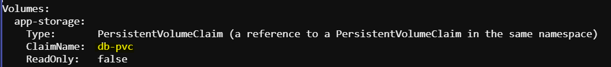
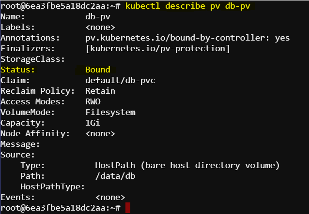
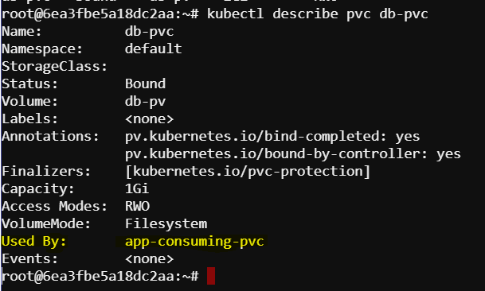
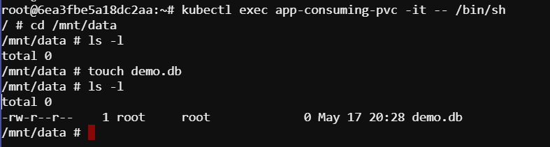

# Understading Persistent Volumes

A `Persistent Volume (PV)` in Kubernetes is a piece of storage in the cluster that has been provisioned by an administrator or dynamically provisioned using `StorageClasses`. PVs are resources in the cluster that provide storage to users and have a lifecycle independent of any individual pod that uses the PV. For instance, database data often needs to be retained beyond the application's lifecycle. This is the role of a persistent volume.



<details>
  <summary><strong>Key Concepts about Persistent Volume</strong></summary>

  1. **PersistentVolumeClaim (PVC)**
     - A PVC is a request for storage by a user.
     - Users can request specific sizes and access modes (e.g., can be mounted once read-write or many times read-only).
     - PVCs are bound to PVs in a one to one relationship, and Kubernetes ensures that the requested storage is available and appropriately matched.

  2. **Access Modes**: 
  Each PersistentVolume can express how it can be accessed using the attribute spec.accessModes.
     - `ReadWriteOnce (RWO)`: The volume can be mounted as read-write by a single node.
     - `ReadOnlyMany (ROX)`: The volume can be mounted as read-only by many nodes.
     - `ReadWriteMany (RWX)`: The volume can be mounted as read-write by many nodes.

  3. **Reclaim Policy**: 
  The reclaim policy specifies what should happen to a PersistentVolume object when the PersistentVolumeClaim is deleted
     - `Retain`: Manual reclamation of the resource.
     - `Recycle`: Basic scrub (rm -rf /thevolume/*).
     - `Delete`: Associated storage asset, such as AWS EBS, GCE PD, or Azure Disk, is deleted.

  
</details>


## Example task

Create a `Persistent Volume` name `db-pv` with capacity `1Gi` and path `/data/db`. Then create a `Persistent Volume Claim (PVC)` named `db-pvc` with a size of `256Mi` and access mode `ReadWriteOnce`. Finally mount the PersistentVolumeClaims in a Pod.

### 1. Creating PersistentVolumes

Create a yaml definition file of kind `PersistentVolume`.

```bash
vim pv.yaml
```

```yaml
apiVersion: v1
kind: PersistentVolume
metadata:
  name: db-pv
spec:
  capacity:
    storage: 1Gi
  accessModes:
    - ReadWriteOnce
  hostPath:
    path: /data/db

```

```bash
kubectl create -f pv.yaml
```

Get information about PV

```bash
kubectl get pv
```


The status `Available` indicates that the object is ready to be claimed.

### 2. Creating PersistentVolumeClaims (PVC)

Now create a yaml definition file of kind `PersistentVolumeClaim` for PVC.

```bash
vim pvc.yaml
```

```yaml
kind: PersistentVolumeClaim
apiVersion: v1
metadata:
  name: db-pvc
spec:
  accessModes:
    - ReadWriteOnce
  storageClassName: ""
  resources:
    requests:
      storage: 256Mi
```

```bash
kubectl create -f pvc.yaml
```

After creating PVC we can get the more information by these commands.

```bash
kubectl get pvc
```

```bash
kubectl describe pvc db-pvc
```



Once a PersistentVolumeClaim (PVC) is created, if its status is `Bound`, it indicates a successful binding to a PersistentVolume (PV). But as of now it is not mounted to any pod. That why `Used by` is showing `<none>`

### 3. Mounting PersistentVolumeClaims in a Pod

```bash
vim pod.yaml
```

```yaml
apiVersion: v1
kind: Pod
metadata:
  name: app-consuming-pvc
spec:
  volumes:
    - name: app-storage
      persistentVolumeClaim:
        claimName: db-pvc
  containers:
    - image: alpine
      name: app
      command: ["/bin/sh"]
      args: ["-c", "while true; do sleep 60; done;"]
      volumeMounts:
        - mountPath: "/mnt/data"
          name: app-storage
```

```bash
kubectl create -f pod.yaml
```

After creating the pod, the `describe` command will provide additional information on the volume:

```bash
kubectl get pods
kubectl describe pod app-conuming-pvc
```


The PersistantVolume now shows that it is `bounded`




The PersistentVolumeClaim now also shows the Pod that mounted it:




Now we can go ahead and open an interactive shell to the Pod. Navigating to the mount path at /mnt/data gives you access to the underlying PersistentVolume:

```bash
kubectl exec app-consuming-pvc -it -- /bin/sh
cd /mnt/data
ls -l
touch test.db
ls -l
```




In this example, we have created a PV named `db-pv` which is a `1Gi` storage volume located at `/data/db` on the `host`. The PVC `db-pvc` requests a volume with `ReadWriteOnce` access mode and `256Mi` of storage. The pod `app-consuming-pvc` uses this PVC, mounting it at `/mnt/data` inside the container.
