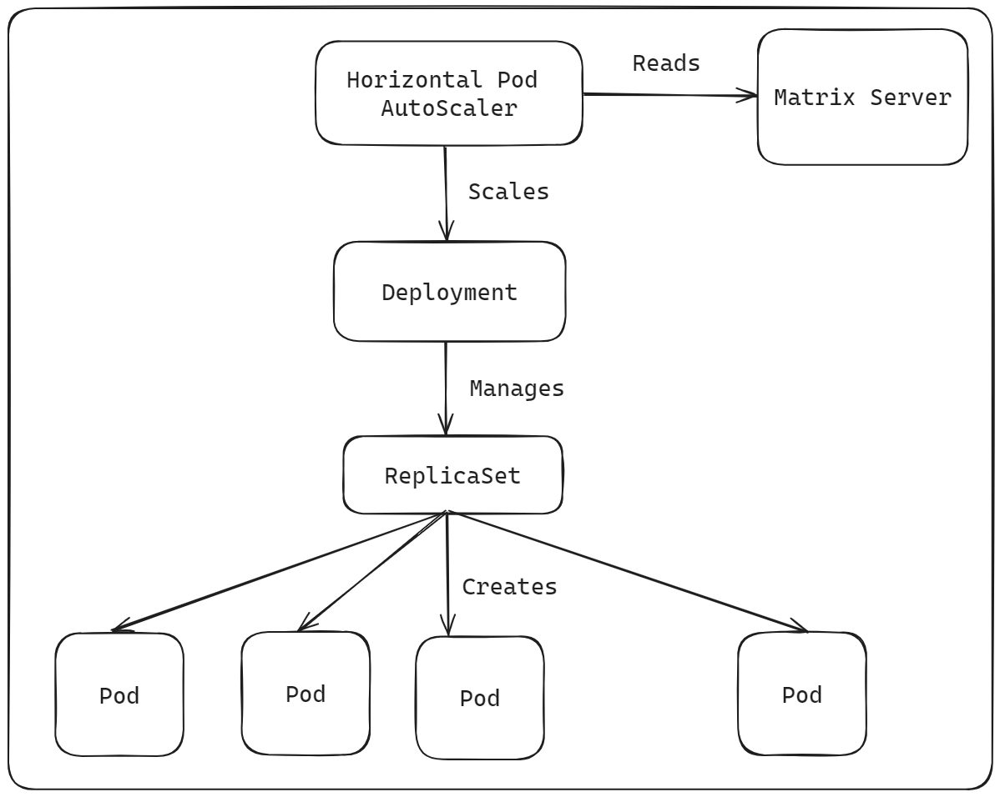
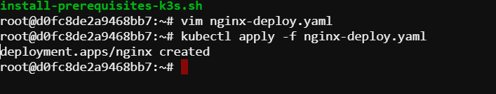
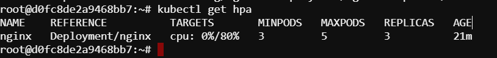

# Autoscaling a Deployment
In this lab, we will attempt two tasks:

1. Create a deployment named 'nginx' that utilizes the latest nginx image with some initial replicas.

2. Establish a Horizontal Pod Autoscaler for the deployment, aiming for an average CPU utilization of 65% and an average memory utilization of 1Gi. Set the minimum number of replicas to 3 and the maximum number of replicas to 10.

**Before going to the implementation we will try to understand what is Scalibilty in kubernetes.**

**Scalability** is the ability of a system to handle increasing load.
Scaling workloads in Kubernetes refers to the ability to adjust the number of instances (replicas) of a workload dynamically based on demand or predefined metrics.

**Horizontal Pod Autoscaler (HPA):** The Horizontal Pod Autoscaler automatically scales the number of pods in a deployment, replica set, or stateful set based on observed CPU utilization or custom metrics. It continuously adjusts the number of replicas to maintain a target utilization level specified in the HPA configuration.



## Create a NGINX deployment

```bash
vim nginx-deployment.yaml
```

```YAML
apiVersion: apps/v1
kind: Deployment
metadata:
  name: nginx
spec:
  replicas: 5
  selector:
    matchLabels:
      app: nginx
  template:
    metadata:
      labels:
        app: nginx
    spec:
      containers:
      - name: nginx
        image: nginx
```

```bash
kubectl apply -f nginx-deployment.yaml
```



## Create Horizontal Pod Autoscalers

We can create an HPA for an existing Deployment by using the `autoscale deployment` command that creates an HPA for the nginx Deployment, with a minimum of 3 replicas and a maximum of 10 replicas, and a target
```bash
$ kubectl autoscale deployment nginx --cpu-percent=80 --min=3 --max=10
```

## Rendering Horizontal Pod Autoscaler Details

The event record of an HPA can offer further understanding of the scaling operations.

```bash
$ kubectl describe hpa nginx
```

## List all the Horizontal Pod Autoscalers:

```bash
$ kubectl get hpa
```
Listing all the HPA objects transparently describes their current state.



If the Pod template of the Deployment does not define CPU resource requirements or if the CPU metrics cannot be retrieved from the metrics server, the left value of the column “TARGETS” says `<unknown>`. We can solve this by defining CPU resource requirements to the Pod template

**1. Delete the nginx deployment**

```bash
$ kubectl delete deployment nginx
```

**2. Update the nginx pod definition file**

```bash
vim nginx-deployment.yaml
```

```YAML
apiVersion: apps/v1
kind: Deployment
metadata:
  name: nginx
spec:
  replicas: 2
  selector:
    matchLabels:
      app: nginx
  template:
    metadata:
      labels:
        app: nginx
    spec:
      containers:
      - name: nginx
        image: nginx
        resources:
          requests:
            memory: "64Mi"  # Request 64 megabytes of memory
            cpu: "50m"      # Request 50 millicores (0.05 cores) of CPU
          limits:
            memory: "128Mi" # Limit memory to 128 megabytes
            cpu: "100m"     # Limit CPU to 100 millicores (0.1 cores)
```

```bash
kubectl apply -f nginx-deployment.yaml
```

3. Now create an HPA object using YAML manifest file.
The YAML manifest representation:

```YAML
apiVersion: autoscaling/v2
kind: HorizontalPodAutoscaler
metadata:
  name: nginx
spec:
  scaleTargetRef:
    apiVersion: apps/v1
    kind: Deployment
    name: nginx
  minReplicas: 3
  maxReplicas: 10
  metrics:
  - type: Resource
    resource:
      name: cpu
      target:
        type: Utilization
        averageUtilization: 65
  - type: Resource
    resource:
      name: memory
      target:
        type: AverageValue
        averageValue: 1Gi
```

```bash
kubectl apply -f nginx-hpa.yaml
```


Here, we can see the CPU usage which is `<unknown>` before defining the resource requirements of the pod definition.